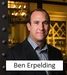

# Optimum Energy Advances with Artificial Intelligence

## Overview and Origin

Optimum Energy, a developer and provider of innovative software solutions and engineering services was founded in 2005 in Seattle, Washinton by Nathan Rothman (Chairman, Founder), and Ben Erpelding (Chief Technical Officer), with the primary offering based upon the previously developed "Hartman Loop" method of chilled water plant control by Tom Hartman (PE,Mechanical Engineer).  Nathan Rothman is a serial entrepreneur. Before founding Seattle-based Optimum Energy in 2006, he launched a number of widely disparate companies, including a bar and restaurant in New York, Valiant Yachts Corp. in Texas, and a manufacturing company that built plants around the world for Nike and Reebok. “I just have this quirky interest in how things work,” says Rothman, 63.  Source:  National Real Estate Investor (Source:  Northwest Real Estate Investor https://www.nreionline.com/sustainability/qa-optimum-energy-s-nathan-rothman )

Nathan said that the idea of starting Optimum Energy came from his experience building manufacturing plants around the world.  He had started companies before that revolutionized that industry.  Because he was an "outdoors kind of guy", he was very concerned about the environment and that those large plants had big costs associated with labor, electricity, and energy costs.  He came across the Hartman Loop technology while building those international plants to North American standards.  He contacted Tom Hartman, and Tom was providing the optimization solution through engineering as a service, customizing the program to optimize each plant individually, taking as long as 3 months or more just to write the software for one chilled water plant.  Nathan convinced Tom to license the technology to "Optimum Energy" so they could develop it into a "plug and play" solution.  The result was a company developing a plug and play optimization that could work with one of any 25 or more companies that sell building automation systems around the world.  (Source:  Northwest Innovation https://www.nwinnovation.com/interview_with_nathan_rothman_optimum_energy/s-0027374.html )

Nathan described the initial funding of $10 million through private equity.  "We're actually private equity funded. In my mind, there's a difference. We view ourselves as transforming an industry, heating and air conditioning, which is very fragmented, and has a "we've always done it this way", not-invented-here attitude--and we're trying to introduce radical technology to that industry. Because of that, it's tough to be able to project where the inflection will come. To cite an example, if you look at fluorescent lighting, where we went from mechanical to solid state ballast in lighting, that took 15 years to implement. That's such a basic change--you're still using fluorescent lighting, and it's just that electronic ballasts work cleaner and better. So, in my mind, private equity has a much longer window and view of the world than venture capital. We raised just about $10M from a private equity fund. I funded things in the beginning, and there are few angels who took small chunks before I met these guys, who took the rest--and we've never gotten out of the board room on subsequent raises. We have no plans to raise more money right now, and we're growing 150 to 200 percent a year."  (Source:  From Northwest Innovation https://www.nwinnovation.com/interview_with_nathan_rothman_optimum_energy/s-0027374.html)  Optimum Energy then hired mechanical engineer and former professional skateboarder Ben Erpelding, PE, of San Diego, California to manage and engineer the link between software engineers and the mechanical engineering aspects of what would become "OptimumLOOP" and other applications.  Ben had successfully implemented "The Hartman Loop" at several facilities while employed by The California Center for Sustainable Energy (now known as the Center for Sustainable Energy).

## Business Activities

Optimum Energy, known in the HVAC industry simply as "OE", was established to cost-effectively develop solutions to operate HVAC equipment more efficiently, saving large amounts of energy and also money, with a desirable return on invest to the customer.  Individual engineers and specialists were already solving small problems on their own across the industry, taking a great deal of time and effort.  Unfortunately, this type of knowledge in the workforce was few and far between. The challenge was developing software that can be profitably applied consistently to systems that are usually very unique or very custom in nature.  The "OE" motto as a startup was "Nail it before you scale it", indicating a goal to make sure a product was developed that could profitably experience rapid growth, consistent margins, and solid returns on investment.

Optimum Energy's intended customers are the owners and operators of large buildings or large campuses of buildings. There are 110,000 buildings in the US with hydronic cooling systems, or "chilled water plants" as they are commonly called, and the base of OE's first application.  Another piece of the market could come from the millions of "rooftop packaged units", which are the HVAC units often seen on top of "box stores", warehouses, and similar stand-alone buildings. There are five million of those installed, with half a million of those being replaced every year.  (Source: Northwest Innovation https://www.nwinnovation.com/interview_with_nathan_rothman_optimum_energy/s-0027374.html)

Optimum Energy has had quite the advantage through early patents that lock down certain applications and algorithms that could only be used by them since 2006.  Since they were an early adoptor, they have engineers and technical staff with as much experience as could possibly be had in this field.  Because it is a niche field of work, securing knowledgable staff and engineers is a key part of their success and maintaining a competitive edge.  Competitors have had to develop algorithms that used alternative methods of control that did not replicate OE's algorithms.  This proved very challenging in the market, since there are only limited ways to optimize the equipment.

Optimum Energy uses a combination of onsite software programming and web-based software as a service (Saas) platforms.  In most cases since 2006, OE has used a  building automation controller called a "JACE" (manufactured by Honeywell and/or Siemens) to store and protect their energy saving formulas onsite, coupled with a "Tridium" front end as the graphic user interface.  The JACE controller is then integrated to the existing controls system through network communication.  OE recently partnered with "Tignis", who is according to Tignis CEO and Co-Founder Jon Herlocker,  "hyper-focused  on leveraging AI to autonomously optimize process control and improve operational efficiency in advanced manufacturing environments."  Tignis is a leader in AI-powered process control solutions to enable next generation manufacturing processes, increase manufacturing output, and improve manufacturing sustainability. The company's products democratize AI and machine-learning, enabling process and operations engineers to design, test and achieve extraordinary AI/ML results in manufacturing environments. Tignis is headquartered in Seattle, WA and the company's technology is deployed in hundreds of facilities worldwide.  (Source: https://www.prnewswire.com/news-releases/optimum-energy-and-tignis-enter-into-a-worldwide-exclusivity-agreement-to-advance-efficiency-for-hvac-solutions-301871523.html ) 
Optimum Energy describes its trademarked solution Optimum Ai™ as Data driven optimization that learns over time through its user interface OptiCx(Registered Trademark).  OptimumAi™ enables a building to continuously and automatically adjust to real-time conditions, significantly lowering operating expenses in a consistent, scalable fashion. "Using advanced Machine Learning algorithms to understand how chillers perform in a variety of operating conditions, OptimumAi™ uses this data to improve overall plant efficiency by determining the most efficient process in every given situation."  (Source:  https://optimumenergyco.com/opticx/ )

## Landscape

Optimum Energy resides in the Heating, Ventilation, and Air Conditioning industry or "HVAC".  Their particular focus is software applications that optimize complex HVAC systems and use less energy over standard, direct from the manufacturer solutions.  Customers include higher education, government and private sector, and particular large buildings or campuses with multiple buildings.  Energy savings HVAC solutions are a major trend in this field over the last 5 to 10 years (source: gitnuz.org/hvac-trends/).  Developing more efficient equipment has hit a plateau.  There is only so much room for improvement in making motors and refrigerant systems more efficient.  Saving energy has become more about using less energy by turning equipment "off" or down to provide just enough energy to meet the heating, cooling, or ventilation requirements of a facility.  Older systems did not do this and often used different kinds of "bypass" such as bypassed air or bypassed water, even refrigerant, to make the equipment easier to operate and manufacture, but not more efficient. It is no longer an option for managers of large facilities to not optimize their systems; it is a question of which company and method will provide the solutions.

Other major companies in this field including most of the major controls and HVAC companies, including Siemens, Johnson Controls, and Trane.  Siemens has its own set of patented solutions, specifically "Demand Flow" which was patented with chiller optimizationg ground work performed by Robert Higgins.  Johnson Controls partnered with Optimum Energy with limited success, while touting their own chilled water optimization solutions on a lower scale.  Trane, as one of the leading manufacturers of chillers (as is Johnson Controls/York products), also promotes their own optimization solutions for their chillers, also with limited acceptance especially at the system level.  The American Society of Heating, Refrigerating and Air Conditioning Engineers (ASHRAE), has published unpatented solutions similar to what the large providers provide but in peicemeal application.  Today, Optimum Energy (originally a small startup) and Siemens (the largest company in the world) go head to head trying to win and optimize the most complex chilled water plants in the entire world.  

## Results

The greatest impact of Optimum Energy was to challenge the HVAC industry to start operating chilled water plants and similar systems differently than they had been operating historically, saving huge amounts of energy.  Optimum Energy provided a scaled software version of the "Hartman Loop" developed by Tom Hartman that was more widely applicable and less custom and less costly.  This caught the attention of customers who were looking to improve their sustainability impact and greenhouse gas footprint, while also catching the attention of HVAC controls companies that sold projects based upon payback.  The competition in the market has led to projects that have 35% energy savings with a payback of five years (Source: https://www.gsa.gov/climate-action-and-sustainability/center-for-emerging-building-technologies/completed-assessments/energy-management/chiller-plant-control-optimization )

As a software startup, the primary metrics for success are revenue, profitability, marketshare, and uniqueness that would allow the company's investors to get their return on investment, likely through a purchase by a larger company. Product acceptance is important in this industry, so "number of installations" has been a metric for acceptance, as well as customer savings.  Optimum Energy currently boasts:
    * Over 500 installations across 4 continents,
    * Nearly $300 million dollars of customer savings 
    * Saved 2.5 billion kilowatt-hours of electricity, and 
    * Reduced greenhouse gases by 3.4 billion pounds. (source: https://optimumenergyco.com/about/)
In 2023, Bernhard Capital Partners, a private equity firm with approximately $3.4 billion in gross assets under management, acquired Optimum Energy.  Optimum Energy had operated as an independent LLC from 2005 until the 2023 acquisition.  

I am a former employee of Optimum Energy, and I now work for a company that contracts with organizations like Optimum Energy in many different sectors.  My employer, Ameresco, Inc. (NYSE:AMRC) is a leading cleantech integrator and renewable energy asset developer, owner and operator.  We are the leading "ESCo" or Energy Service Company in the North American market.  Our close competitor is Siemens ESCo, whose optimization technology in a separate division is a direct competitor to Optimum Energy.  As a general contractor, Ameresco has contracted with both Optimum Energy and Siemens.   

Ameresco currently has over 60 regional offices located throughout the United States, Canada, the United Kingdom, and Europe.  Ameresco and CEO George Sakellaris released the following financials in its 2023 Financial Results:
    *Record Total Project Backlog of nearly $4B, with $520M in New Awards in Q4
    *717 MWe of Assets in Development, with 63 MWe Placed into Operation in the Quarter Guiding to 38% Adj. EBITDA Growth at 
        the Midpoint for 2024
    *Revenues of $1,374.6 million and $441.4 million
    *Net income attributable to common shareholders of $62.5 million and $33.7 million
    
    

## Recommendations

Ameresco should greatly expand its solution portfolio in artificial intelligence and energy savings.  Older, more mature strategies are limited to basic algorithms that have reached their limit of success.  Traditional algorithms have to be adjusted manually after trial and error with the supervision of a technically savvy operator or team of operators with expertise in the systems being used.  AI based solutions can adjust performance in most cases without supervision (or verified on an ongoing basis).  The vast complexity of these networked HVAC and energy generating systems including wind, solar, and battery storage require AI intervention to reach their peak performance and saving every bit of energy possible in world of declining natural energy resources and increasing demand. 

Because Ameresco is a leader in the field with a strong commitment to "doing well by doing good", Ameresco has the base of ethics and technical know-how to lead the way in introducing artificial intelligence as a main component to the controls of energy generation and energy use.  Advanced techniques will be required with a growing population and energy sector to reduce greenhouse gases, and not only stop but reverse the impact of climate change.  This introduction of artificial intelligence in the sector would follow the "Energy as a Service" model, utilizing a combination of edge computing analytics and cloud-based analytics.  The introduction of edge computing concepts helps bridge a security gap introduced with cloud-based analytics.  Network security has become a critical issue, and many mission critical facilities could not take advantage of cloud-based analytics because of remote access concerns.  

Link to Art Institute of Chicago, an Ameresco AI Project:
https://www.linkedin.com/posts/ameresco_museumfacilities-energyoptimization-iamfa-activity-7107796341254168576-V5TP
